# DevContext

<p align="center">
  <a href="https://www.powershellgallery.com/packages/DevContext"></a>
  <a href="https://www.powershellgallery.com/packages/DevContext"></a>
  <a href="https://github.com/thierryvm/devcontext/actions/workflows/ci.yml"></a>
  <a href="LICENSE"></a>
  
</p>

**Your identity, your credentials and your AI tooling follow the folder you are
standing in — not the account you last logged into.**

One context = one folder + one complete identity: git email, SSH key, GitHub
account, Vercel session, Supabase tokens, VS Code profile, MCP servers. Several
coexist at once. You never log out of anything.

```powershell
work perso               # this terminal is now "perso"
cd C:\Work\Clients\acme  # …and this folder belongs to a client
ctx                      # NO-GO — and it tells you why
```

<p align="center">
  
</p>

> No context is loaded in that terminal, and the guard still holds — because it
> decides from the folder, not from the session. That distinction is the whole
> tool. [The story of how I learned it](docs/article/committed-under-the-wrong-identity.md).

---

## The problem

Every tool a developer uses assumes **one account per machine**.

`gh auth login` replaces the previous account. `vercel login` replaces the
previous session. Your AI assistant's MCP connections are attached to whichever
account you authorised last, machine-wide. So a developer working on personal
projects and client projects spends their day switching — and every switch is a
chance to commit under the wrong name, deploy to the wrong project, or point a
migration at the wrong database.

The usual advice is to be careful. That is not a mechanism.

DevContext replaces care with a property: **the folder decides**. Stand in a
folder, and the identity, the credentials and the tools that apply there are the
ones you get. Stand in the wrong one, and you are told before anything leaves
your machine.

## Why not just switch accounts?

Because switching is state, and state drifts. The three failures below are the
ones that actually happen, and none of them announce themselves:

- You commit under your personal email in a client repository, because
  `user.email` was set globally three months ago.
- `gh pr create` opens a pull request from the wrong account, because `gh`
  keeps one global config and remembers the last login.
- `supabase db push` applies migrations to production from a feature branch,
  because three git worktrees point at the same linked project and nothing
  distinguishes them.

DevContext turns each of those into a refusal instead of an incident.

---

## What makes it different

**It is not tied to any AI vendor.** MCP is an open standard. `ctx mcp` writes
project-scoped configuration for Claude Code, VS Code and Cursor alike, taking
credentials from the environment rather than from a vendor account. Change
assistant, change provider, bring your own key — the folder still decides. Being
locked to one vendor's account is the problem this tool removes; being locked to
one vendor's *tool* would be the same mistake wearing a different hat.

**The guard lives in `PATH`, not in a shell.** A PowerShell alias protects only
PowerShell. It does nothing for git-bash, an npm script, `execFileSync` from
Node, or an AI agent's shell — which are precisely the callers most likely to
make the mistake. DevContext's guard sits in `PATH`, so every caller passes
through it.

**It decides from the folder, never from the session.** No variable to remember
to set, no state to keep in your head. A fresh terminal with no context active
is still protected, because the answer is derived from where you are standing.

**Your editor gets its own sign-ins, whatever the editor.** VS Code, Cursor,
Windsurf, Trae and their relatives store account sessions per profile directory,
so one directory per context means independent GitHub, Copilot and marketplace
sessions — live at the same time, instead of signing out of one to sign into
another. DevContext does not ship a list of editors: it **finds** the ones on
your machine and **measures** what each supports, because a hardcoded table is
wrong on the second machine it meets.

**It tells you what is wrong before you find out the hard way.** `ctx doctor`
answers, for the current folder: which tools are installed, which account each
one will actually reach, whether the tokens are still valid, where a credential
is sitting in clear text in a config file, and which of your shortcuts will
quietly open a client project on your personal profile.

It watches **its own root**, too. A context is a folder carrying a
`context.json`, and everything else in that root used to be ignored in silence —
a stray folder sat there for nine days with nothing to name it. The case that
costs is not the stray folder but the *undone* context: strip a context folder of
its `context.json` and it keeps its `ssh/` keys and `gh/` sessions, while no
`work` ever loads it again.

**It looks for the credential that answers from everywhere.** Compartmentalising
holds as long as a tool is reached through `PATH` — that is where the shims sit.
A credential left at a tool's *default* location belongs to no context and
answers from any folder, a client's included. On 18 August 2026 `npx --yes
vercel@latest`, a form that consults no `PATH` at all, left a personal
account's token exactly there, and nothing reported it. `ctx doctor` now sweeps
those default locations for `gh`, `vercel` and `supabase`, and names the
identity a global config still declares — silently, when the folder belongs to no
context, because a boundary has to exist before it can be crossed.

---

## Install

Requires **Windows** and **PowerShell 7+**.

```powershell
Install-PSResource DevContext        # or: Install-Module DevContext
ctx init                             # tells you what is left, and how
```

**`ctx init` is the one command to remember.** It reports what is already in
place and what is missing, then prints the exact command for each remaining
step. It installs nothing on your behalf and creates no context for you — both
are decisions, not chores — and it does not prompt at all when input is
redirected, so an agent or a CI job gets the same list in a form it can act on.

The step it will almost certainly name first:

```powershell
pwsh -NoProfile -File (Join-Path (Get-Module DevContext -ListAvailable)[0].ModuleBase 'installer-shims.ps1')
```

That line is what puts the production guard in `PATH`. Without it the guard
exists only inside a PowerShell session that imported the module — which covers
neither git-bash, nor npm scripts, nor `execFileSync` from Node, nor an AI
agent's shell. That is, none of the callers most likely to make the mistake.

**Run it again after every module update.** `PATH` names a stable path that never
changes, but the junction behind it has to be repointed at the new version.
`ctx doctor` says so out loud when it is stale, rather than letting the guard go
quiet — see [`docs/GUIDE.md`](docs/GUIDE.md).

<details>
<summary>Installing from a clone instead, to work on the module</summary>

```powershell
git clone https://github.com/thierryvm/devcontext.git
New-Item -ItemType SymbolicLink `
    -Path   "$HOME\Documents\PowerShell\Modules\DevContext" `
    -Target (Resolve-Path .\devcontext)

pwsh -NoProfile -File .\devcontext\installer-shims.ps1
```

The symlink means the module PowerShell loads and the repository you edit are
the same files — there is no copy to keep in sync, and no chance of fixing the
one that is not being executed. Tests ship with the clone, not with the package:
`pwsh -NoProfile -File .\tests\RunTests.ps1`.

</details>

Then create your first context — `ctx` tells you this itself when there are none:

```powershell
ctx-new -Name perso -Email you@example.com -Root C:\dev\perso
```

A context is a complete identity: git email, SSH key, GitHub account, Vercel
session, Supabase tokens. One per working life, not one per project.

**Where they live.** By default `%LOCALAPPDATA%\DevContext\contexts` on Windows,
`~/.local/share/devcontext/contexts` elsewhere. Put them wherever you like —
another drive, an encrypted volume:

```powershell
ctx-root D:\DevContext      # remembered for every future session
ctx-root                    # shows the current root and where the setting came from
```

**Language.** Commands speak your system language when it is one of the two
translated (English, French), and English otherwise:

```powershell
$env:DEVCTX_LANG = 'en'   # or 'fr'
```

A missing translation renders its key — `[ctx.noGo]` — rather than an empty
line, so a gap is visible instead of silent.

`DEVCTX_ROOT` overrides it for a single shell, a test, or a CI job. Contexts hold
SSH keys, so a removable drive is a real choice with real consequences — the
command lets you make it, and does not move anything on your behalf.

`INSTALLATION.md` documents the rollback for every machine-level change: the
`PATH` entry, the junction, the `vscode://` handler. Each one is reversible with
a single command, and each is backed up before it is touched.

**New here? [`docs/GUIDE.md`](docs/GUIDE.md)** walks from an empty machine to a
working day, and lists what to do when something is wrong.

Install details: [`INSTALLATION.md`](INSTALLATION.md) ·
Reasoning: [`POURQUOI.md`](POURQUOI.md) ·
Internals: [`docs/ARCHITECTURE.md`](docs/ARCHITECTURE.md)

---

## Commands

| Command | What it answers |
|---|---|
| `ctx init` | What is missing on this machine, and the exact command for each |
| `work <ctx>` | Load an identity into this terminal |
| `ctx` | Do the folder, the identity and the account agree? **GO / NO-GO** |
| `ctx-doctor` | What works in this folder, and on which account? |
| `ctx-doctor -Live` | Are the tokens still valid, and do they open the right account? |
| `ctx-dashboard` | The same answers as a page: every context, account, project and MCP server, read-only |
| `ctx-sb` | Which Supabase project lives on which account, and which folders point at it |
| `ctx-mcp` | Write MCP configuration for this project, bound to its own credentials |
| `ctx-list` | Every context on this machine |
| `ctx-new` | Create a context — `-NoKey` when nothing can answer a passphrase prompt |
| `ctx-root` | Where contexts are stored, and change it |
| `ctx-who` | Which context owns this folder |
| `ctx-editors` | Which editors are installed, and can each one be isolated? |
| `ctx-shortcut` | Write a shortcut that opens a project in its own context |
| `code-ctx` | Open an editor with this context's profile and environment |

**Every `ctx-<name>` also works as `ctx <name>`** — `ctx doctor`, `ctx list`,
`ctx new`. The hyphen tab-completes under PowerShell; the space is what every
other CLI taught your fingers. They are the same command, derived from one
table, so they cannot drift apart. `ctx help` lists them, and a typo gets the
list rather than an error about a function you have never heard of.

**`ctx dashboard` writes the whole picture to a page and opens it.** Read-only,
and it decides nothing: every verdict on it comes from `ctx doctor`, every row
from the commands above. The file lands in your application data, restricted to
you and rewritten each time -- it carries which project sits on which account,
which is a reconnaissance document if it is left lying about. It reaches no
network, neither while gathering nor from the page itself.

`ctx-doctor -Json` emits machine-readable output, for CI or for an AI agent.

**`ctx doctor -Fix` applies what the report already spells out** — and only what
it can prove and undo: empty `PATH` entries, shims missing from `PATH`, a stale
junction. Everything else is **named with the reason it stays manual**, because
an unexplained silence reads as *nothing more to do*. `-WhatIf` shows the gesture
without making it; the `PATH` repair writes a backup first and preserves the
registry value kind.

The most common finding it will *not* touch is `gh/compte`, and the reason is
worth stating: the fix is `work <context>`, which sets variables in the
**calling** shell — and a child process cannot write into its parent's
environment. That is an operating-system property, not a missing feature.

---

## Editors

An editor keeps its GitHub, Copilot and marketplace sessions inside its profile
directory, encrypted per user. Give each context its own directory and the
sessions stop colliding — every editor in the VS Code family exposes that as
`--user-data-dir`, and it is where the mechanism starts.

The difficulty is that nothing else in your day passes that flag. A shortcut you
made, `code .` in a terminal, "Open with" from the file explorer, an npm script,
an agent — all of them open the shared profile. So DevContext puts an entry
point for each editor in `PATH`, ahead of the real one:

```
$ cd C:\Work\Clients\acme\site
$ code .          # opens on acme's profile, with acme's gh, acme's tokens

$ cd C:\Work\Apps\my-thing
$ code .          # opens on your own profile — both windows at once
```

Set `DEVCTX_SHIM_TRACE=1` and it says, on stderr, which context it picked and
why. "My editor opened on the wrong account" has no answer otherwise.

**Isolation is not the same as being signed into the right account.** A separate
profile stops sessions from overwriting each other; nothing stops you signing
into the wrong account inside the right profile — and a client window where
Copilot and the Pull Request extension act as your personal identity is an
incident you only notice afterwards. `ctx doctor` names it when one context's
profile carries another context's GitHub account. It found exactly that on the
author's machine, in both directions at once, the day the check was written.

**Expect to sign in once per context, and read that as the mechanism working.**
A separate profile directory is a separate secret store, so the first window you
open for a new context will ask for GitHub and Copilot. That one sign-in is the
price of the thing you came for: signing in for a client no longer signs you out
of your own account, and both windows stay live side by side. `ctx doctor` says
so in the report rather than leaving you to guess it from a login prompt.

**One flag stopped being enough on 19 August 2026.** VS Code 1.133 moved
*application* storage — extension secrets, the recently-opened list, the
trusted-folders list — out of the profile directory and into `~/.vscode-shared`,
a single store for the whole machine:

```
[shared storage] Creating shared storage database at
   'c:\Users\<me>\.vscode-shared\sharedStorage\state.vscdb'
```

The encryption stayed per profile. So two contexts write the same entry under
two different keys, the second cannot read the first, and the editor discards it
and asks you to sign in — every launch, forever. The give-away is one line in
the editor's own log: `Error while decrypting the ciphertext`. On the machine
that found it, six launches carried that line and those same six read back zero
sessions.

The sign-in loop is the symptom people notice. The one that matters is that a
**client** project path was sitting in the recently-opened list of a **personal**
window, and a folder trusted in one context was trusted in all of them.

DevContext now passes `--shared-data-dir` alongside the other two, and
`ctx doctor` checks the result on disk rather than trusting the flag — because
this is exactly the kind of thing an editor can change again without telling
anyone.

**Discovered, not declared.** `ctx-editors` looks for editors and probes what
each one supports:

```
Editeur             Commande      Profil  Extensions  Partage     Methode
Visual Studio Code  code          isole   isolees     isole       measured
Cursor              cursor        isole   isolees     sans objet  measured
Windsurf            windsurf      isole   isolees     sans objet  measured
Antigravity         antigravity   isole   partagees   sans objet  declared
Trae                trae          isole   isolees     sans objet  measured
```

`measured` means the flag was tried and the directory it named appeared.
`declared` means the flag was read from the application's own files — weaker
evidence, reported as such rather than rounded up. Antigravity is the case that
settles the argument for measuring: it accepts `--user-data-dir` and has no
`--extensions-dir` at all, which no amount of "it is a VS Code fork" would have
told you.

`sans objet` in the `Partage` column is not a shrug — it is the answer. Those
editors declare no `sharedDataFolderName` in their own `product.json`: they were
forked from a VS Code that predates the machine-wide store, so they have none,
and `--user-data-dir` still covers everything for them. Reporting them as
`COMMUN` would have put a permanent warning on three editors out of four, on a
perfectly tidy machine. *Does not accept `--shared-data-dir`* and *shares its
storage* are two different sentences.

Where the column does say something, it is always on `declared` evidence,
whatever the `Methode` column says — and that limit is worth knowing. The
command-line path never initialises the shared store, so probing it measures
nothing: `--shared-data-dir Z` alongside `--list-extensions` exits 0 and creates
no `Z`. An absent side effect is not evidence of absence, and answering
"unsupported" there would state more than is known while wearing a
measurement's authority. What *can* be measured is the outcome, once you have
actually opened the editor — and that is what `ctx doctor` reports.

Add an editor DevContext does not know by dropping an `editors.json` next to
your contexts:

```json
[{ "name": "myeditor", "label": "My Editor", "profile": "myeditor",
   "command": "D:\\tools\\myeditor\\bin\\myeditor.cmd" }]
```

**Shortcuts.** A shortcut whose target is `C:\...\Code.exe` bypasses `PATH`
entirely — nothing can fix that from the outside, which is what an absolute path
means. `ctx doctor` therefore reads the shortcuts on your desktop, start menu and
taskbar and reports which ones will open a context project on the shared profile.
`ctx-shortcut -Path <project>` writes a correct one.

---

## Example — what a diagnosis looks like

<p align="center">
  
</p>

The last two lines are the ones that matter. Not *is this token valid* — that is
easy and nearly worthless — but **is it valid on the account this folder
expects**, and does it actually reach this folder's project. A perfectly good
token on the wrong account is the failure that costs you an afternoon, and a
naive check blesses it.

No token value is ever printed. Only the name of the key holding it.

> **Language.** Command output is bilingual since 1.3.0 — 268 keys in English
> and French, picked from your system language or forced with `DEVCTX_LANG`. The
> whole suite runs under both in CI, because a translation is only real when
> something checks it in the language that did not write the code.

---

## The production guard

Against a Supabase project tagged `prod`:

- `supabase db reset` — **refused**, unconditionally. There is no legitimate use
  for it against production, so the guard costs nothing and prevents everything.
- `supabase db push`, `migration repair`, `migration up` — **refused** from any
  branch other than the repository's default. This is the worktree case: three
  folders, one linked project, one of them holding fewer migrations than the
  others.
- Everything else passes through untouched.

Any uncertainty passes through. A guard that blocks whenever it hesitates gets
uninstalled within the week, and an uninstalled guard protects nothing.

Against Vercel: a `--prod` deployment from a branch other than the default, and
`env rm` naming `production`. `rollback` and `promote` are deliberately left
alone — refusing a repair gesture always lands during an incident.

To override for a single command — never in `$PROFILE`:

```powershell
$env:DEVCTX_ALLOW_PROD = 1
```

One variable per tool, so waiving one guard never waives the others.
`ctx doctor` names every one that is set.

---

## `gh` under the right account, from any shell

`gh` reads its account from `GH_CONFIG_DIR`. Without it, it falls back to the
machine-wide config — whichever account you logged into last. `work` sets the
variable, but `work` is a PowerShell command, so from git-bash, an npm script or
an agent's shell it was never set. **That is the failure this whole tool was
built around**, and it was handled by a rule people had to remember: *never run
`gh` from bash*.

The entry point in `PATH` now resolves the context from the **folder** and
supplies the directory itself, on the child process only:

```bash
cd /f/PROJECTS/Clients/acme/site
gh pr create              # goes out as the acme account, from git-bash
```

It **corrects rather than refuses**, which is the difference with the Supabase
guard: nobody can guess which database you meant, but the folder already knows
which account owns it. It refuses only when it has nothing to supply — the
context has no `gh` account yet — and then only for commands that *write*, while
naming the two lines that fix it. A `GH_CONFIG_DIR` you set deliberately is
never overwritten; a mismatch refuses writes and flags reads on stderr.

---

## Security

Tokens live in a SecretManagement vault and reach tools through environment
variables. Nothing is written to disk in clear text, and no generated file
contains a credential — that is what makes `.mcp.json` safe to commit.

What is guarded, and equally importantly what is **not** — WSL, absolute-path
invocation, fail-open by design — is set out in
[`SECURITY.md`](SECURITY.md). Report a vulnerability privately through GitHub's
Security tab.

---

## Tests

```powershell
pwsh -NoProfile -File .\tests\RunTests.ps1
```

479 tests across unit, contract, integration, cross-shell (PowerShell, cmd,
git-bash) and repository-security levels, run in **both languages** on every
push. Destructive commands are exercised against a **decoy binary** that
announces itself: a guard tested against the real CLI would mean betting a
database on the guard working.

What the suite does and does not guarantee: [`tests/README.md`](tests/README.md).

---

## License

MIT — see [`LICENSE`](LICENSE).
